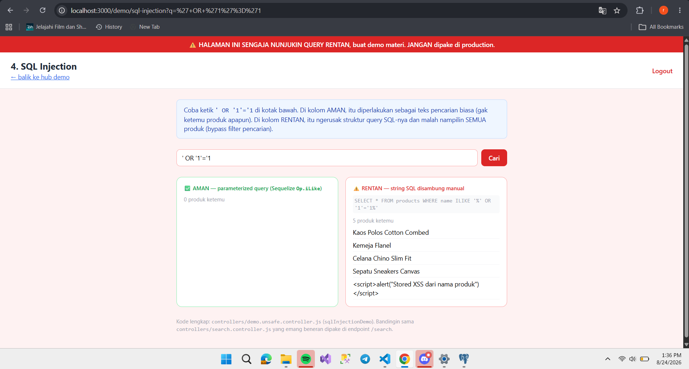
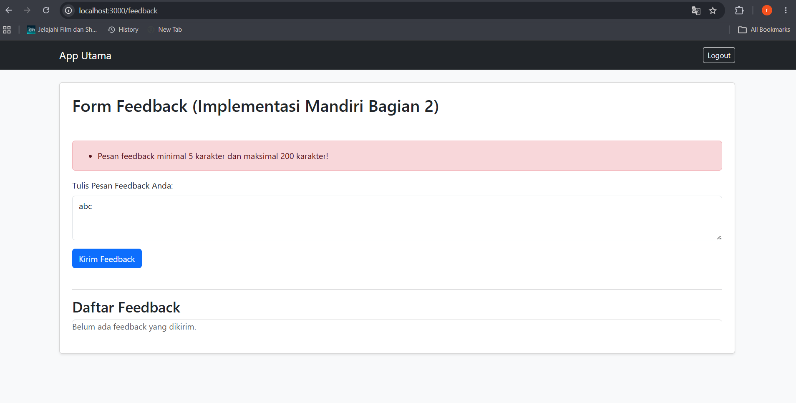
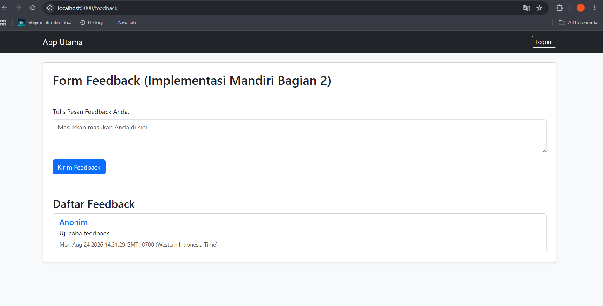
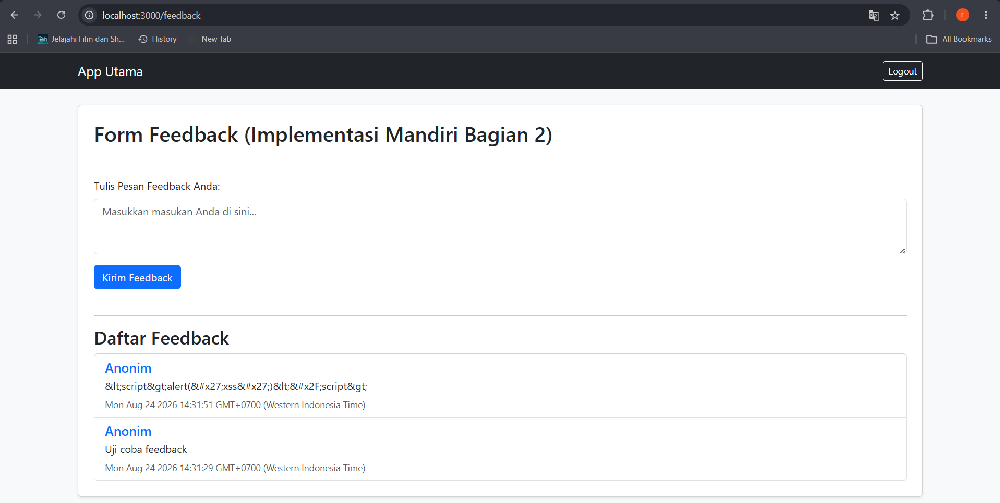
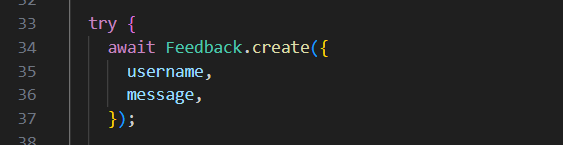
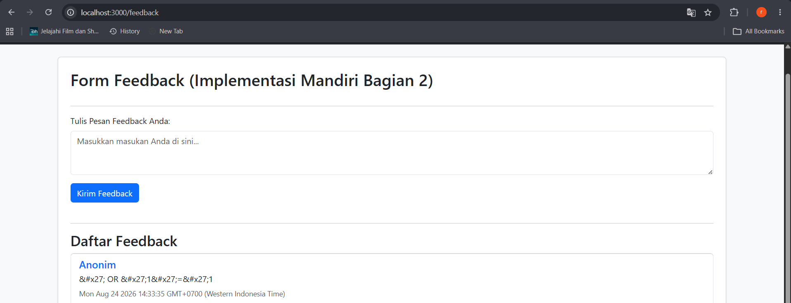

# Laporan Praktikum Keamanan Web

## Bagian 1 — Bukti Celah Keamanan (Demo)

### 1. SQL Injection

*Penjelasan:* Payload `' OR '1'='1` berhasil tembus karena query database dibuat dengan menggabungkan string secara langsung (`SELECT * FROM users WHERE username = '` + input + `'`) tanpa sanitasi atau parameterized query.

### 2. XSS Reflected

*Penjelasan:* Payload `` pada parameter URL berhasil dieksekusi oleh browser dan menampilkan pop-up bertuliskan "XSS dari" karena controller langsung merender input dari query string ke dalam respon HTML tanpa proses sanitasi/escape.

### 3. XSS Stored

*Penjelasan:* Payload skrip berbahaya telah tersimpan di database dan otomatis tereksekusi saat halaman pencarian dimuat (menampilkan pop-up "Stored XSS dari nama produk") karena data nama produk dari database ditampilkan menggunakan tag mentah (*raw/unescaped*) tanpa di-escape terlebih dahulu.

### 4. Escape HTML (Celah Unescaped)

*Penjelasan:* Input `` berhasil mengeksekusi JavaScript karena tampilan EJS menggunakan tag `<%- input %>` (raw/unescaped) alih-alih `<%= input %>`.

---

## Bagian 2 — Implementasi Mandiri (Fitur Feedback)

### 1. Validasi Server-Side

*Penjelasan:* Input pesan di bawah 5 karakter ditolak oleh server menggunakan middleware `express-validator` dan menampilkan pesan kesalahan berwarna merah di atas form.

### 2. Sanitasi Input

*Penjelasan:* Masukan pengguna disanitasi menggunakan `.trim()` sehingga spasi berlebih di awal dan akhir teks otomatis dipotong sebelum disimpan ke database.

### 3. Data Di-escape Saat Render (Anti-XSS)

*Penjelasan:* Payload `` gagal tereksekusi dan hanya tampil sebagai teks biasa karena EJS menggunakan tag `<%= item.message %>` yang secara otomatis meng-escape karakter berbahaya menjadi HTML entities (`&lt;script&gt;`).

### 4. Parameterized Query / ORM

*Penjelasan:* Pembuatan data menggunakan Sequelize ORM (`Feedback.create()`) secara otomatis mengisolasi masukan pengguna sebagai bound parameters sehingga aman dari SQL Injection.

### 5. Percobaan Serangan Gagal

*Penjelasan:* Serangan SQL Injection dengan payload `' OR '1'='1` gagal tembus dan hanya tersimpan utuh sebagai teks string biasa.